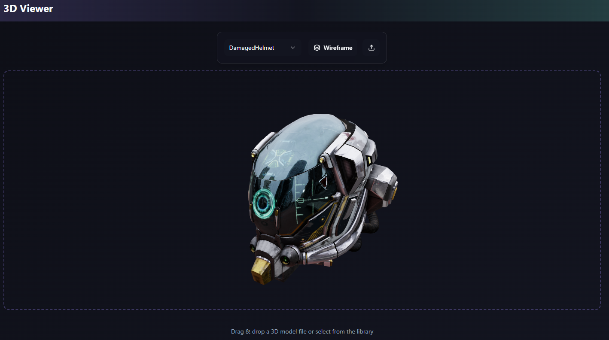

# 3D Model Viewer in Three.js



Questo progetto è una web app realizzata con [Three.js](https://threejs.org/) che permette di visualizzare modelli 3D in tempo reale direttamente dal browser.

## 🚀 Funzionalità

- ✅ **Visualizzazione 3D** interattiva di modelli `.glb` o `.gltf`
- 📂 **Caricamento drag & drop**: trascina un file 3D direttamente nella finestra del viewer
- 📁 **Selezione da menu**: scegli uno dei modelli predefiniti dal menu a tendina
- 🧵 **Modalità wireframe**: attiva la visualizzazione a reticolo della mesh del modello

## 🖱️ Come usarlo

### ✅ Online

Puoi usare il viewer direttamente dalla versione online pubblicata su GitHub Pages:

📎 **[Vai al sito](https://danzer-bit.github.io/ThreeJsViewer/)**

---

### 🔧 In locale

1. Clona il repository:

   ```bash
   git clone https://github.com/danzer-bit/ThreeJsViewer.git
   ```

2. Spostati nella directory del progetto:

   ```bash
   cd ThreeJsViewer
   ```

3. Installa le dipendenze:

   ```bash
   npm install
   ```

4. Avvia la preview in locale:

   ```bash
   npm run dev
   ```

---

## 📦 Build per la produzione

Per generare la build ottimizzata da caricare su GitHub Pages:

```bash
npm run build
```

La versione compilata sarà disponibile nella cartella `dist/`.

---

## ⚙️ Tecnologie usate

- [Three.js](https://threejs.org/) – rendering 3D
- [React](https://react.dev/)
- [TypeScript](https://www.typescriptlang.org/)
- [Vite](https://vitejs.dev/) – bundler e dev server veloce
- [shadcn/ui](https://ui.shadcn.dev/) – componenti UI moderni
- [Tailwind CSS](https://tailwindcss.com/) – utility-first CSS

---

## 🧾 Licenza

Questo progetto è distribuito sotto licenza MIT. Vedi il file `LICENSE` per maggiori dettagli.

---


